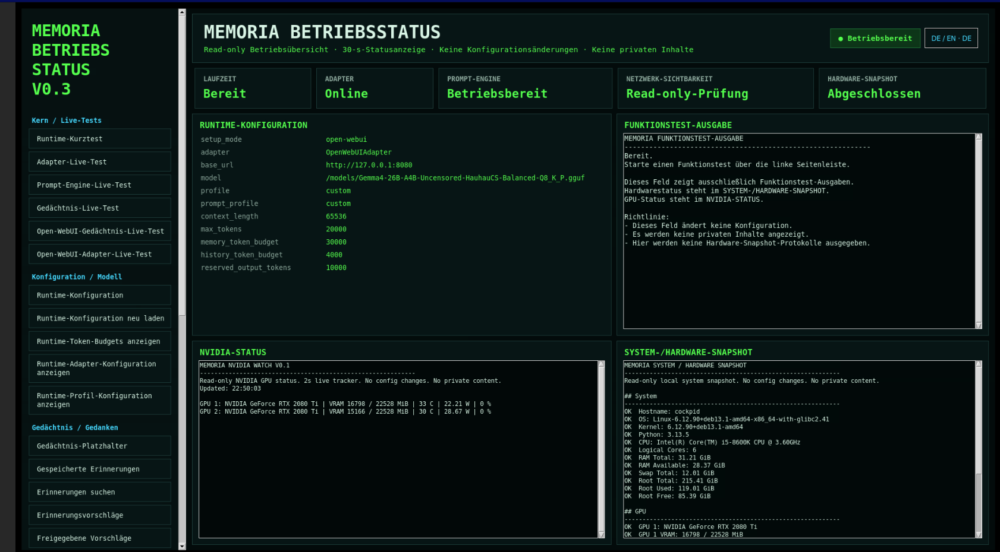
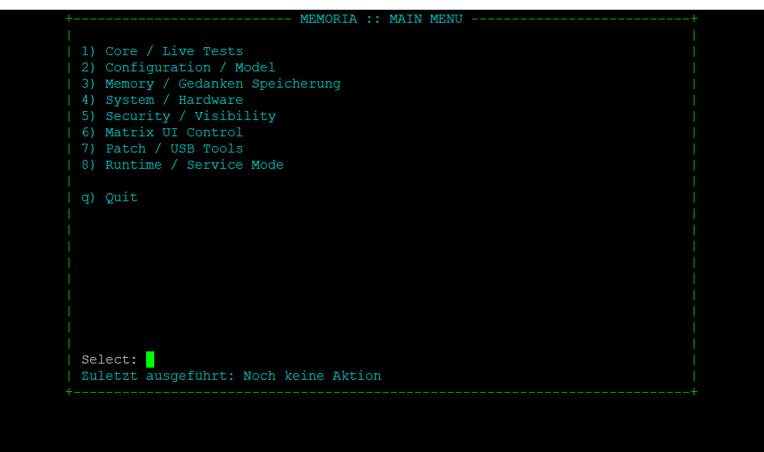

# MEMORIA

**Local memory infrastructure for user-controlled AI systems**  
**Lokale Gedächtnisinfrastruktur für benutzerkontrollierte KI-Systeme**

**Version: 0.2.0-beta**  
**Languages / Sprachen: English · Deutsch**

---

## Preview / Vorschau

Screenshots from a local development installation, shown in German. MEMORIA supports English and German. These are interface previews, not retrieval benchmarks or a guarantee that every displayed feature is included in the published release. Model, hardware and token-budget values are examples, not requirements.

Screenshots einer lokalen Entwicklungsinstallation in deutscher Sprache. MEMORIA unterstützt Deutsch und Englisch. Die Bilder zeigen die Oberflächen, keinen Retrieval-Benchmark und keine Zusage, dass jede sichtbare Funktion im veröffentlichten Release enthalten ist. Modell, Hardware und Token-Budgets sind Beispiele, keine Voraussetzungen.

### Operating dashboard / Betriebsübersicht

Read-only overview of runtime configuration, the Open WebUI adapter, token budgets and hardware status. “V0.3” identifies the dashboard component, not the MEMORIA release.

Read-only-Übersicht über Runtime-Konfiguration, Open-WebUI-Adapter, Token-Budgets und Hardwarestatus. „V0.3“ bezeichnet die Dashboard-Komponente, nicht den MEMORIA-Release.



### Terminal cockpit / Terminal-Cockpit

Administrative main menu for memory workflows, configuration and diagnostics.

Administratives Hauptmenü für Gedächtnisabläufe, Konfiguration und Diagnostik.



---

## English

### What is MEMORIA?

MEMORIA provides a controlled and durable memory layer for locally operated AI systems.

Its central principle is **User Sovereignty**:

**Your AI. Your data. Your memory. Your decision.**

MEMORIA does not silently decide what becomes permanent memory.

The normal memory lifecycle is:

```text
Input
  ↓
Memory Candidate
  ↓
User Review / Approval
  ↓
Promotion
  ↓
Durable Memory
  ↓
Retrieval
```

Memory Candidates remain in the review layer until they are explicitly approved.

Retrieval uses approved durable Memory and Knowledge. Candidates are not treated as durable Memory.

### Local-first and user-controlled

MEMORIA is designed around clear safety and privacy boundaries:

- no hidden telemetry
- no unrestricted scanning of private directories
- no automatic durable Memory by default
- no silent Memory promotion
- no automatic upload of private data
- no silent destructive Memory operations
- no unauthorized access to unrelated local or remote AI systems
- no automatic overwriting of the user's AI backend configuration

The user decides which local paths, AI backends and Memory sources MEMORIA may use.

### Current BETA capabilities

MEMORIA currently includes, among other components:

- Memory Candidate review and approval
- promotion to durable Memory
- Candidate archive and deletion workflows
- durable Memory lifecycle controls
- Memory undo back to Candidate review
- guarded Memory Trash workflows
- Memory Retrieval
- configurable Memory token budgets
- Memory usage diagnostics
- guided large archive import
- user-declared Memory file import
- explicit local attachment workflows
- local OCR implementation with Pillow and Tesseract (currently gated from public installer profiles)
- Open WebUI integration
- llama.cpp Direct integration
- Ollama integration
- Matrix Terminal Cockpit
- optional Matrix graphical interface
- runtime, storage and system diagnostics

### Attachment and OCR boundary

The current local Attachment workflow is available for explicitly selected
files.

Local OCR is implemented and operates only on explicitly selected images.
It is not enabled as a public installer feature profile in the current release.
The public installer profiles are `minimal` and `matrix-ui`.
OCR results are not automatically persisted as Candidates or durable Memory.

Automatic Open WebUI attachment retrieval, ownership-bound attachment bridging
and grouped Photo-Memory creation are not part of the current release scope.

### Supported operating model

The initial public MEMORIA release is designed around a simple operating model:

- one locally operated AI installation
- one administrative user
- user-controlled local infrastructure
- explicitly configured AI backends

Multi-user and tenant-separated installations are not part of the initial public operating model.


### Platform support

**Officially supported for MEMORIA 0.2.0-beta: Debian GNU/Linux 13 (Trixie).**

The automated MEMORIA package and installation path currently supports
the tested `debian-13` platform profile only.

Other Linux distributions are currently **not supported by the automated
package/install path** and are blocked fail-closed instead of receiving
Debian package names or installation commands blindly.

This does not mean that MEMORIA itself can never run on another Linux
distribution. Additional distributions require their own detected,
implemented and tested platform/package profile before they can be
enabled safely.

Community test reports for other distributions are welcome, but
`COMMUNITY TESTED` does not automatically mean `OFFICIALLY SUPPORTED`.

Commercial use is permitted under the AGPL-3.0-or-later terms. Separate commercial licensing may be offered for deployments that require different licensing terms or support arrangements.

### Backend independence

MEMORIA is not tied to one specific model, GPU or context size.

Current integration paths include:

- llama.cpp Direct
- Open WebUI
- Ollama
- Manual / Advanced configuration

Context sizes and token budgets depend on the user's own AI system and hardware.

MEMORIA does not automatically change the backend configuration of a local AI system.

### Languages

MEMORIA currently supports:

- English
- Deutsch

The installer asks for the preferred language during first setup.

Private user content is not automatically translated merely because the interface language changes.

### Installation

MEMORIA 0.2.0-beta is a **public beta release**.

The existing installer already performs setup and safety checks including:

- Python availability
- MEMORIA project structure
- local-data consent
- important Python module compilation
- MEMORIA Doctor
- backend mode selection
- optional Matrix UI preflight
- post-install validation

Current setup modes include:

```text
doctor-only
llama-cpp-direct
open-webui
ollama
manual-advanced
```

The complete clean-system installation workflow and signed public distribution package have been validated for MEMORIA 0.2.0-beta.

### Security and updates

MEMORIA 0.2.0-beta uses cryptographically verified release distribution.

The release architecture is intended to include:

- SHA-256 integrity manifests
- cryptographic release signatures
- a controlled MEMORIA update path
- fail-closed behavior when verification fails
- no silent automatic self-updates

The private release-signing key will not be distributed with MEMORIA.

### Public release package

The public MEMORIA package is intentionally separated from the development workspace.

Development-only or private material is not intended to be shipped, including:

- architecture decision records used for internal development
- development test scripts
- backups and retired files
- Python cache files
- secrets and credentials
- private Memories
- Memory Candidates
- private conversations
- private attachments
- machine-specific local deployment configuration

### Project website

`memoriallm.life`

Official download, documentation, support and licensing information is provided
through the official MEMORIA project channels.

### License

MEMORIA Core is licensed under the GNU Affero General Public License,
version 3 or (at your option) any later version (`AGPL-3.0-or-later`).

Commercial use is permitted under the AGPL terms. Separate commercial
licensing may be offered for organizations that require different licensing
terms, integration agreements or support arrangements.

See `LICENSE` for the complete license text.

---

## Deutsch

### Was ist MEMORIA?

MEMORIA stellt eine kontrollierte und dauerhafte Gedächtnisschicht für lokal betriebene KI-Systeme bereit.

Das zentrale Prinzip lautet **User Sovereignty – Benutzerhoheit**:

**Deine KI. Deine Daten. Dein Gedächtnis. Deine Entscheidung.**

MEMORIA entscheidet nicht still oder heimlich, was zu einer dauerhaften Erinnerung wird.

Der normale Gedächtnisweg lautet:

```text
Eingang
  ↓
Memory Candidate / Review-Becken
  ↓
Prüfung und Freigabe durch den Benutzer
  ↓
Promotion
  ↓
Dauerhafte Erinnerung
  ↓
Retrieval
```

Memory Candidates bleiben im Review-Becken, bis sie ausdrücklich freigegeben werden.

Retrieval verwendet freigegebene dauerhafte Erinnerungen und Knowledge. Candidates gelten nicht als dauerhaftes Memory.

### Local-first und unter Benutzerkontrolle

MEMORIA folgt klaren Sicherheits- und Datenschutzgrenzen:

- keine versteckte Telemetrie
- kein ungefragtes Scannen privater Verzeichnisse
- standardmäßig kein automatisches dauerhaftes Memory
- keine versteckte Memory-Promotion
- kein automatischer Upload privater Daten
- keine stillen destruktiven Memory-Aktionen
- kein nicht autorisierter Zugriff auf fremde lokale oder entfernte KI-Systeme
- kein automatisches Überschreiben der Backend-Konfiguration des Benutzers

Der Benutzer entscheidet, welche lokalen Pfade, KI-Backends und Gedächtnisquellen MEMORIA verwenden darf.

### Aktuelle BETA-Funktionen

MEMORIA enthält derzeit unter anderem:

- Prüfung und Freigabe von Memory Candidates
- Promotion zu dauerhaftem Memory
- Candidate-Archiv- und Löschworkflows
- Lifecycle-Steuerung dauerhafter Memories
- Memory Undo zurück ins Candidate-Review
- geschützte Memory-Papierkorb-Workflows
- Memory Retrieval
- konfigurierbare Memory-Token-Budgets
- Memory-Nutzungsdiagnosen
- Guided Big Archive Import
- vom Benutzer deklarierter Gedächtnisdatei-Import
- explizite lokale Attachment-Workflows
- lokale OCR-Implementierung mit Pillow und Tesseract (derzeit nicht in öffentlichen Installer-Profilen freigeschaltet)
- Open-WebUI-Integration
- llama.cpp Direct
- Ollama
- Matrix Terminal Cockpit
- optionale grafische Matrix-Oberfläche
- Runtime-, Storage- und Systemdiagnosen

### Attachment- und OCR-Abgrenzung

Der aktuelle lokale Attachment-Workflow steht für ausdrücklich ausgewählte
Dateien zur Verfügung.

Lokale OCR ist implementiert und arbeitet ausschließlich mit ausdrücklich
ausgewählten Bildern. Im aktuellen Release ist sie nicht als öffentliches
Installer-Feature-Profil freigeschaltet. Die öffentlichen Installer-Profile
sind `minimal` und `matrix-ui`. OCR-Ergebnisse werden nicht automatisch als
Candidate oder dauerhaftes Memory gespeichert.

Automatischer Open-WebUI-Dateiabruf, eine ownership-gebundene Attachment-Bridge
und gruppierte Photo-Memories gehören noch nicht zum aktuellen Release-Umfang.

### Erstes Betriebsmodell

Der erste öffentliche MEMORIA-Release ist bewusst einfach aufgebaut:

- eine lokal betriebene KI-Installation
- ein administrativer Benutzer
- vom Benutzer kontrollierte lokale Infrastruktur
- ausdrücklich konfigurierte KI-Backends

Multi-User- und mandantengetrennte Installationen gehören nicht zum ersten öffentlichen Betriebsmodell.


### Plattform-Unterstützung

**Offiziell unterstützt für MEMORIA 0.2.0-beta: Debian GNU/Linux 13 (Trixie).**

Der automatisierte MEMORIA-Paket- und Installationspfad unterstützt
derzeit ausschließlich das getestete Plattformprofil `debian-13`.

Andere Linux-Distributionen werden vom automatisierten Paket-/
Installationspfad derzeit **nicht unterstützt** und fail-closed
blockiert, statt Debian-Paketnamen oder Installationsbefehle blind
zu übernehmen.

Das bedeutet nicht, dass MEMORIA grundsätzlich niemals auf einer
anderen Linux-Distribution laufen kann. Weitere Distributionen
benötigen zuerst ein eigenes erkanntes, implementiertes und getestetes
Plattform-/Paketprofil, bevor sie sicher freigegeben werden können.

Community-Testberichte für andere Distributionen sind willkommen,
aber `COMMUNITY TESTED` bedeutet nicht automatisch
`OFFICIALLY SUPPORTED`.

Kommerzielle Nutzung ist unter den Bedingungen der AGPL-3.0-or-later zulässig. Für Installationen, die abweichende Lizenzbedingungen oder Supportvereinbarungen benötigen, kann eine separate kommerzielle Lizenz angeboten werden.

### Backend-Unabhängigkeit

MEMORIA ist nicht an ein bestimmtes Modell, eine bestimmte GPU oder eine feste Kontextgröße gebunden.

Aktuelle Integrationswege sind:

- llama.cpp Direct
- Open WebUI
- Ollama
- Manual / Advanced

Kontextgrößen und Token-Budgets richten sich nach dem jeweiligen lokalen KI-System und der vorhandenen Hardware.

MEMORIA verändert die Backend-Konfiguration einer lokalen KI nicht automatisch.

### Sprachen

MEMORIA unterstützt derzeit:

- Deutsch
- English

Der Installer fragt beim ersten Setup nach der gewünschten Sprache.

Private Benutzerinhalte werden nicht automatisch übersetzt, nur weil die Oberflächensprache geändert wird.

### Installation

MEMORIA 0.2.0-beta ist ein **öffentlicher Beta-Release**.

Der vorhandene Installer führt bereits verschiedene Setup- und Sicherheitsprüfungen durch:

- Python-Verfügbarkeit
- MEMORIA-Projektstruktur
- Zustimmung zu lokalen Datenregeln
- Compile-Prüfung wichtiger Python-Module
- MEMORIA Doctor
- Auswahl des Backend-Modus
- optionale Matrix-UI-Vorprüfung
- abschließende Validierung

Aktuelle Setup-Modi:

```text
doctor-only
llama-cpp-direct
open-webui
ollama
manual-advanced
```

Der vollständige Clean-System-Installationsweg und das signierte öffentliche Distributionspaket wurden für MEMORIA 0.2.0-beta validiert.

### Sicherheit und Updates

MEMORIA 0.2.0-beta verwendet eine kryptografisch verifizierte Release-Distribution.

Die Release-Architektur soll enthalten:

- SHA-256-Integritätsmanifest
- kryptografische Release-Signaturen
- kontrollierten MEMORIA-Updatepfad
- Fail-Closed-Verhalten bei fehlgeschlagener Verifikation
- keine stillen automatischen Selbstupdates

Der private Release-Signaturschlüssel wird niemals mit MEMORIA ausgeliefert.

### Öffentliches Release-Paket

Das öffentliche MEMORIA-Paket wird bewusst vom Entwicklungsarbeitsbereich getrennt.

Interne Entwicklungs- oder private Daten sollen nicht ausgeliefert werden. Dazu gehören insbesondere:

- interne Architecture Decision Records
- Entwicklungs-Testskripte
- Backups und ausgemusterte Dateien
- Python-Cache-Dateien
- Secrets und Zugangsdaten
- private Memories
- Memory Candidates
- private Unterhaltungen
- private Attachments
- maschinenspezifische lokale Deployment-Konfiguration

### Projektseite

`memoriallm.life`

Offizielle Download-, Dokumentations-, Support- und Lizenzinformationen werden
über die offiziellen MEMORIA-Projektkanäle bereitgestellt.

### Lizenz

MEMORIA Core steht unter der GNU Affero General Public License,
Version 3 oder (nach eigener Wahl) jeder späteren Version
(`AGPL-3.0-or-later`).

Kommerzielle Nutzung ist unter den Bedingungen der AGPL zulässig.
Für Organisationen, die abweichende Lizenzbedingungen,
Integrationsvereinbarungen oder Supportregelungen benötigen,
kann eine separate kommerzielle Lizenz angeboten werden.

Der vollständige Lizenztext steht in `LICENSE`.

---

## Status

**MEMORIA 0.2.0-beta — Public Beta / Öffentliche Beta**

**Your AI. Your data. Your memory. Your decision.**  
**Deine KI. Deine Daten. Dein Gedächtnis. Deine Entscheidung.**
